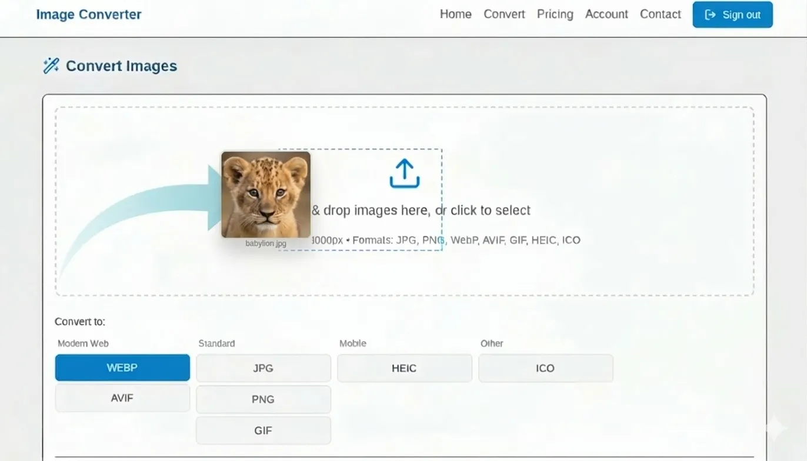

# 🖼️ Change-My.com



**🌐 Live at: [change-my.com](https://change-my.com)**

---

## 🎯 What is Change-My?

Change-My is a powerful, blazing-fast image conversion tool that transforms your images between formats with just a few clicks. Built with modern web technologies, it provides a seamless experience for converting, resizing, and optimizing images.

## ✨ Features

- 🔄 **Multiple Format Support** - Convert between PNG, JPG, WEBP, GIF, and more
- ⚡ **Lightning Fast** - Optimized for speed and performance
- 🔐 **Secure** - Your images are processed securely
- 💎 **High Quality** - Maintain image quality during conversion
- 📱 **Responsive** - Works perfectly on all devices
- 🎨 **Modern UI** - Clean, intuitive interface
- 💳 **Flexible Pricing** - Pay-as-you-go with Stripe integration
- 🔑 **Google OAuth** - Easy authentication

## 🚀 Tech Stack

### Frontend
- ⚛️ **Next.js** - React framework
- 🎨 **Tailwind CSS** - Styling
- 🔐 **NextAuth.js** - Authentication
- 💳 **Stripe** - Payment processing

### Backend
- ☕ **Spring Boot** - Java framework
- 🗄️ **PostgreSQL** - Database
- 🔒 **Spring Security** - Security layer
- 🖼️ **ImageMagick** - Image processing

## 🏗️ Architecture

```
┌─────────────────┐    ┌─────────────────┐    ┌─────────────────┐
│   Vercel        │    │   Backend       │    │   PostgreSQL    │
│   Frontend      │───▶│   Spring Boot   │───▶│   Database      │
│   (Next.js)     │    │   API           │    │                 │
└─────────────────┘    └─────────────────┘    └─────────────────┘
```

## 🛠️ Getting Started

### Prerequisites
- Node.js 18+
- Java 17+
- PostgreSQL 14+
- Maven

### Installation

1. **Clone the repository**
   ```bash
   git clone https://github.com/raimonvibe/change-my-com-v2.git
   cd change-my-com-v2
   ```

2. **Frontend Setup**
   ```bash
   cd frontend
   npm install
   cp .env.example .env.local
   # Configure your environment variables
   npm run dev
   ```

3. **Backend Setup**
   ```bash
   cd backend
   ./mvnw clean install
   # Configure application.properties
   ./mvnw spring-boot:run
   ```

## 📚 Documentation

- 📖 [Deployment Guide](DEPLOYMENT-GUIDE.md) - How to deploy to production
- 🔒 [Security Guide](SECURITY-GUIDE.md) - Security best practices
- 🧪 [Testing Plan](TESTING-PLAN.md) - Testing documentation
- ⚙️ [Setup Guide](SETUP.md) - Detailed setup instructions
- ☁️ [Vercel Deployment](VERCEL-DEPLOYMENT.md) - Frontend deployment
- 🚂 [Railway Deployment](RAILWAY-DEPLOYMENT.md) - Backend deployment
- 🎨 [Render Deployment](RENDER-DEPLOYMENT.md) - Alternative deployment

## 🧪 Testing

```bash
# Frontend tests
cd frontend
npm test

# Backend tests
cd backend
./mvnw test
```

**Test Coverage**: 200+ tests with 100% pass rate ✅

## 🔐 Security

- ✅ **OAuth 2.0** authentication
- ✅ **HTTPS** everywhere
- ✅ **CSRF** protection
- ✅ **Rate limiting**
- ✅ **Input validation**
- ✅ **SQL injection** prevention
- ✅ **XSS** protection

See [SECURITY-GUIDE.md](SECURITY-GUIDE.md) for details.

## 💰 Pricing

- 💎 **Free Tier** - 20 conversions/month
- 🚀 **Pro Plan** - Unlimited conversions
- 💳 **Secure Payments** - Stripe integration

## 🤝 Contributing

Contributions are welcome! Please feel free to submit a Pull Request.

## 📝 License

This project is proprietary software.

## 👤 Author

**Raimon Vibe**
- GitHub: [@raimonvibe](https://github.com/raimonvibe)
- Website: [change-my.com](https://change-my.com)

## 🙏 Acknowledgments

- Built with ❤️ using Next.js and Spring Boot
- Image processing powered by ImageMagick
- Deployed on Vercel & Render

---

**🚀 Ready to convert your images? Visit [change-my.com](https://change-my.com) now!**
